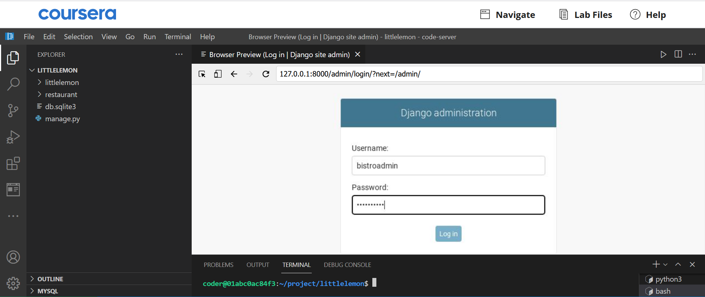
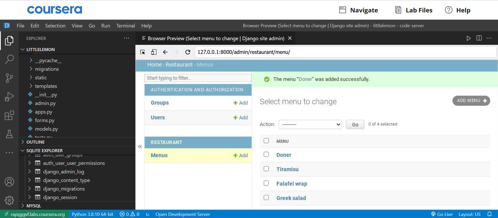
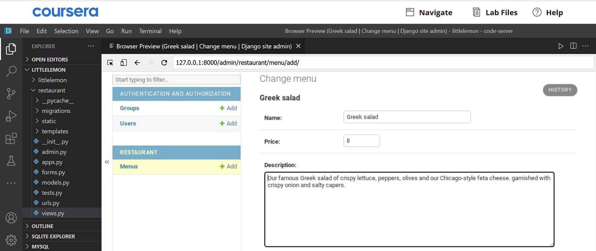

## **Introduction**

Congratulations on coming this far in your journey with working in Django!

This graded assessment is one of your final steps to test the skills and understanding you acquired with the Django framework.

While the difficulty level is subjective to a learner based on many factors, patience and perseverance are key to working with any back-end framework. Good luck!

**Goal**

The Course Assessment will require learner to build the two pages of the web app and be split majorly into two parts:

1. Create the Menu page
2. Create the Menu Item page

**Scenario**

By now you are fairly familiar with the aspirations of the owners Mario and Adrian in providing the best experience to their customers.

While Little Lemon is a local neighborhood bistro, both the owners have long understood the importance of digital presence as a means of convenience and connection for their visitors.

So far, you have helped Little Lemon by building a prototype of their website using the Django framework.

You have been instrumental in testing different website components, from creating views to dynamic templates and building models and forms.

It is now time to bring it all together and help finish the website already under construction by completing the most critical aspect of a food restaurant website, its Menu page!

**Learner Instructions**

The Little Lemon website will consist of five pages:

- Home
- About
- Booking
- Menu
- Menu Item

To complete this graded assessment, you will need to modify the following files:

- settings.py
- urls.py (app-level)
- models.py
- views.py
- admin.py
- templates/menu.html
- templates/menu\_item.html
- templates/partials/\_footer.html

**Supporting files**

Additionally, it's important to know that the following files already consists some of the code added in support of your work:

- views.py
- urls.py (project-level)
- urls.py (app-level)
- forms.py
- models.py
- templates/about.html
- templates/index.html
- templates/book.html
- templates/partials/\_footer.html


It's also important to know that the project contains supportive files for static images and CSS styling.

While working on the project, it is always a good practice to understand the code present.

Other than the template language tags, there is HTML code added in place to support the page, which along with CSS, has helped build the webpage UI.

During the project, you will run the commands inside the VS Code terminal.

To open, go to **Terminal** from the Menu bar at the top of your screen and select **New Terminal**.


Throughout the lab exercises, you worked with the names **myproject** for the project and **myapp** for the app.

In this assessment, the names are more suitable for a real-world scenario. The project is named  **littlelemon** , and the app inside the project is named  **restaurant**. And these are already created.

# **Steps**

# Part 1 – Create the Menu page

**Step 1:**

Open the **models.py** file and create a class called `Menu` with the following attributes:


**Menu**

| **Attribute** | **Field type** | **Arguments** |
| --- | --- | --- |
| name | CharField | max\_length = 200 |
| price | IntegerField |

**Note:** The class called `Booking` is already in place.

Additionally, define a **dunder method** `__str__()` inside this model class such as:

```
def __str__(self):
       return self.name
```


**Step 2:**

Open the **admin.py** and register the `Menu` model.

**Tip:**  Ensure you have imported the model from the **models.py** file.

**Step 3:**

Now that the code for the `Menu` model is complete, run the two commands in the command line to make and perform migrations.

**Tip:** Ensure you are present inside the directory containing the file  **manage.py**.

You can step inside a directory by typing the change directory command, for example, `cd abc`. You can step out of a directory by typing the command `cd ..` 

Successful migrations should display like the following:


**Step 4:**

Open the project-level and app-level  **urls.py**  files to ensure the URL path configurations are in place. The app-level **urls.py** should have the URL configurations for the pages Home, About and Booking.

**project-level urls.py**

```
from django.contrib import admin
from django.urls import path, include

urlpatterns = [
    path('admin/', admin.site.urls),
    path('', include('restaurant.urls')),
]
```

**app-level urls.py**

```
from django.urls import path
from . import views


urlpatterns = [
    path('', views.home, name="home"),
    path('about/', views.about, name="about"),
    path('book/', views.book, name="book"),
]
```

**Step 5:**

You must now add data to the model you created using the Django admin panel.

Inside the terminal, first run the command to create a superuser with the following details:

- Username: bistroadmin
- Email admin@littlelemon.com
- Password as lemon@786!


**Step 6:**

Still inside the terminal, add the command to run the server.

Open the Browser with the **Browser Preview** button in the left menu in VS Code and paste the localhost URL generated after running the server.

Next, add the suffix **/admin** to the URL and press Enter.

Enter the credentials for the superuser you created and log in to the Django admin panel.



**Step 7:**

Inside the Django admin panel, locate the **Menu model** under  **Restaurant** , which is the app's name.

Next, open the  **Menu** , click on  **Add Menu** , and enter the details provided inside the zip file containing the text for the Menu items.

Once you have completed adding all the menu items, the menu model should have the following data:



**Step 8:**

Back in VS Code, open the **views.py** file. Notice that the code for the view functions for `home()`, `about()`, and `booking()` are already in place.

**Note:** The necessary packages are already imported. Make sure to remove the comments for all the imported packages.

**Step 9:**

Create a view function for the menu page called `menu()` and pass the `request` argument.

**Step 10:**

Add the following view logic inside the `menu()` view function:

- Create a variable called `menu_data` and assign it the value of `objects.all()` which is called over the `Menu` model class.
- Create a variable called `main_data` and assign a dictionary that contains the following key-value pairs:

| **Key** | **Value** |
| --- | --- |
| **"menu"** as a string | **menu\_data** |


- Return the `render()` function from the view with the following arguments passed inside it in this order:
  - The `request` object
  - The template name `'menu.html'` passed as a string
  - The dictionary object with a string value `"menu"` as the key and a variable `main_data` as its value

**The code for the menu view is complete for the first part. Make sure you review the code to ensure that it contains no errors.**

**Step 11:**

Open the app-level **urls.py** file and add the URL path for the menu view function using the **path()** function.

**Step 12:**

Expand the app-level directory **templates** in the explorer panel and observe the different HTML files created for building the web page.

**Step 13:**

Create a file called **menu.html** and add the following starter code inside it:

```



<h1>Menu</h1>
<!--Begin col-->
<div class="column">
   <!-- Step 14: Create for loop -->
   <p>
      <!-- Step 14: Add DTL variable for name -->
      <span class="menu-price">
         <!-- Step 14: Add DTL variable for price --> 
      </span>
   </p>
   <!-- Step 14: End or loop -->
</div>
<!--End col-->

```

**Step 14:**

Now that you have the starter code in place follow the instructions below to add Django Template Language (DTL), which will replace the comments.

**Note:**  All the instructions below represent the code in DTL and require appropriate syntax for template tags.

Create a `for` loop that will iterate over the `menu` object using a temporary iterator such as `item`.

Between the enclosing paragraph tags `<p>` and `</p>` , print the `name` attribute in the `item` variable.

Between the enclosing HTML span tags `<span>` and `</span>` , print the `price` attribute present inside the `item2` variable.

To add the currency symbol and the price formatting, prefix the opening curly bracket with the **$** symbol and suffix the closing curly brackets of the **DTL variable** with **.00** as below.

`<span class="menu-price">${{ DTL variable }}.00</span>`

### The First part of the project is complete, and you are ready to run the development server.


Open the terminal and add the command to run the server.

Copy the URL **http://127.0.0.1:8000** generated, press the **Browser Preview** button in the left explorer panel of VS Code and paste it into the browser window.

The homepage of the Little Lemon website should load.


Click on the **Menu** link to verify that the menu page loads correctly. The menu page should display the menu items and price as follows:


# Part 2 – Create the Menu item page

**Menu item page**

The menu item page will display the entire contents of data stored in the menu\_item table for each menu item. The page will be accessed via a dynamic link from the menu page. It will use URL parameters to query the database.

**Step 1:**

Open the file **models.py** and update the `Menu` model with the attributes below in addition to the ones already present:

| **Attribute** | **Form field type** | **Arguments** |
| --- | --- | --- |
| menu\_item\_description | TextField | max\_length=1000, default=' ' |


Once the code in the **models.py** file is updated, run the commands to perform the migrations.

**Step 2:**

Open the Django admin using the credentials created earlier and update menu items already added with the description provided in the zip file.

Once inside the Django admin panel, select the **Menu** under **Restaurant** , which will then display the list of **Menu items** present, such as below:


Select a specific item from the list to edit. It will open a page such as below:



Update the description with the details provided in the zip folder.

**Step 3:**

Open the **views.py** file and create a view called `display_menu_items` with two arguments passed inside it:

- `request`
- `pk` with value `None`

**Step 4:**

Add the code by following the pseudo code example below to define the view logic for the view `display_menu_items` :

| **Pseudo code** |
| --- |
| **if `pk`:**  
| - Create a variable `menu_item` and assign it the value of `objects.get(pk=pk)` which is called over the `Menu` model class.  
| **else:** 
| - Assign an empty string to the variable `menu_item`. |


Return the `render()` function from the view with the following arguments passed inside it in that order:

- The `request` object
- The template name `'menu.html'` as a string
- A dictionary object with a string value `"menu_item"` as the key and a variable `menu_item` as its value

**Step 5:**

Open the app-level **urls.py** file and add a `path()` function inside the `urlpatterns` list as below:

` path('menu_item/<int:pk>/', views.display_menu_item, name="menu_item"), `

**Step 6:**

Before you configure the new menu item page, open the file **menu.html** and update the code as below:

Look for the template code added while designing the menu page:

`{{ item.menu\_item\_name }}`

Surround the code such as:

```
<a href="<Replace with DTL code for url>">
{{ item.menu_item_name }}
</a>
```

Select the complete text inside the `href` attribute beginning with `<` and ending with `>` and replace it with the code below:

` `

**Note:**  The code replaced must not remove the enclosing quotes `" "` for the string. The code will generate a link for the Menu item page, which you will configure next.

**Step 7:**

Create a file called **menu_item.html** inside the templates directory present inside the app directory called **restaurant**.

**Step 8:**

Add the below starter code inside **menu_item.html** page:

```
 
 

<section>
   <article>
      <h1>Menu item</h1>
      <span>
         <a href="">Home</a> /
         <a href="">Menu</a>/
         <!-- Step: Replace code here -->
      </span>
      <!--Begin row-->
      <div class="row">
         <!--Begin col-->
         <div class="column">
            <h2>
               <!-- Add DTL variable for menu_item_name --> 
            </h2>
            <p>
               <!-- Add DTL variable for description --> 
            </p>
            <p>
               <!-- Add DTL variable for price --> 
            </p>
         </div>
         <!--End col-->
         <!--Begin col-->
         <div class="column">
            " alt="{{ menu_item.name}}" />
         </div>
         <!--End col-->
      </div>
      <!--End row-->
   </article>
</section>

```


**Step 9:**

Follow the steps below to replace the code matching the HTML comments such as:

`<!-- --\> `

with the matching steps below:

**Note:**  All the code replacements must have the appropriate Django template language syntax.

- Add name attribute present inside the `menu_item` object
- Add menu item description attribute present inside the `menu_item` object
- Add price attribute present inside the `menu_item` object
  - Prefix the opening curly bracket ( `{` ) with: **Price: $** and 
  - Suffix the closing curly brackets of the DTL ( `}` ) with **.00**
  - **Note:**  Ensure the changes are inside the enclosing `<p>` `</p>` tags.
- Replace the comment `<!-- Step 9: Replace code here -->` inside the `` tag with:

`/static/img/menu\_items/{{menu\_item.name}}.jpg`

**Note:** The code above must be added inside the enclosing strings (`" "`)

Save the **menu_item.html** file. Make sure all the other file changes are saved.

**Step 10:**

Add ** ** a command to run the server. Copy the localhost URL, open the browser from the **Browser Preview** and paste the URL  **http://127.0.0.1:8000/menu**  in the address bar.

**Step 11:**

The same page displayed earlier will load with the change of the menu item now displaying as a hyperlink:


**Step 12:**

Click on the link **Greek Salad** to open the menu item page.

**Step 13:**

The menu item page for **Greek Salad** should appear as below:


**Step 14:** If you have time, feel free to check that the other hyperlinks are working.


# Part 3 – Create the footer template

**Step 1:**

Open the file **_footer.html** already in place and paste the following code inside it:

```

<footer>
  <article>
        " />
  </article>
  <article>
    <p>Copyright Little Lemon</p>
  </article>
</footer>
```

**Step 2:**

Replace the code inside angled brackets present inside the img tag with: 
``  

**Note:** Make sure you also remove the angled (`< >`) brackets.

**Step 3:**

Open the file **base.html** and search for a comment: `<!--Footer content-->` 
On the line below, add a DTL tag that will include the relative path of the **footer.html** file.

## **Additional Steps**

**Step 1**

On the Little Lemon website you have built, click on the tab  **Book**

Enter the details under  **Make a reservation**  as below:

- Enter your initials as the First and Last name
- Enter the number of guests and some comments for your preferences at the bistro.

Press on the  **Submit**  button

**Step 2**

Go to VS Code and right click on  **db.sqlite3**. Select  **Open Database**  from the options.  **SQLITE EXPLORER**  option will be generated at the bottom. of the file menu in VS Code

**Step 3**

Click on  **SQLITE EXPLORER**  to expand and further expand  **db.dqlite3**  under it. Scroll down to the table  **restaurant_booking** in the list of tables that populate.

Click on the  **'play'**  icon displayed on hover. You should be able to see the reservation form data you had updated.